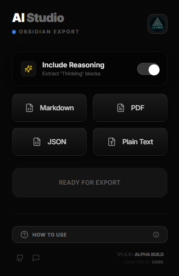

# AI Studio Exporter | Obsidian Edition ⚫

> **Hyper Mode for your Conversations.** Export Google AI Studio chats to MD, PDF, JSON, or TXT with a state-of-the-art interface.

<div align="center">
  <table>
    <tr>
      <td align="center" valign="bottom">
        
      </td>
      <td align="center">
        
      </td>
    </tr>
  </table>
</div>

---

## ⚫ The "Obsidian" Overhaul (v1.2.0)

This isn't just a tool; it's a premium experience. This exporter features a cutting-edge **Ultra-Dark Carbon Fiber** aesthetic with **Glassmorphism** overlays, making it the most sophisticated exporter for Google AI Studio.

### ✨ Key Features

- **Premium Design System**: Glassmorphism UI with internal shimmer effects, bold typography (Inter), and high-gloss controls.
- **Smart Data Extraction**: A self-contained heuristic engine that identifies user/model messages even in dynamic, obfuscated DOMs.
- **Reasoning Toggle**: Choose whether to include the model's "Thinking" blocks in your exports—perfect for Obsidian knowledge bases.
- **Multi-Format Support**:
  - **Markdown (.md)**: Optimized for Obsidian with proper syntax highlighting.
  - **PDF (.pdf)**: High-quality, client-side generated documents.
  - **JSON (.json)**: Structured raw data for developers.
  - **Plain Text (.txt)**: Quick, no-nonsense text dumps.
- **Connection Stability**: Built-in smart monitors to detect and fix communication gaps with the browser via a dedicated Refresh helper.

---

## 🚀 Installation & Setup

Since this is a developer-grade tool, you'll load it as an unpacked extension:

1. **Build the extension**:

   ```bash
   npm install
   npm run build
   ````

2. **Open Extensions**: Navigate to `chrome://extensions/` in Google Chrome.

3. **Enable Developer Mode**: Toggle the switch in the top-right corner.

4. **Load Unpacked**: Click "Load unpacked" and select the **`dist`** folder inside this project directory.

5. **Activate**: Open [Google AI Studio](https://aistudio.google.com/) and **refresh the page** (F5).

---

## 🛠️ Tech Stack

- **Framework**: React 18 + TypeScript
- **Bundler**: Vite (Multi-entry for Popup & Content Scripts)
- **Styling**: Tailwind CSS + Pure CSS Refinements
- **Icons**: Lucide React
- **Export Engines**: jsPDF & DOM-to-Text Heuristics

---

## 📜 Changelog

Check out the [changelog.md](changelog.md) for the full history  and recent architecture improvements.

---

```
```
